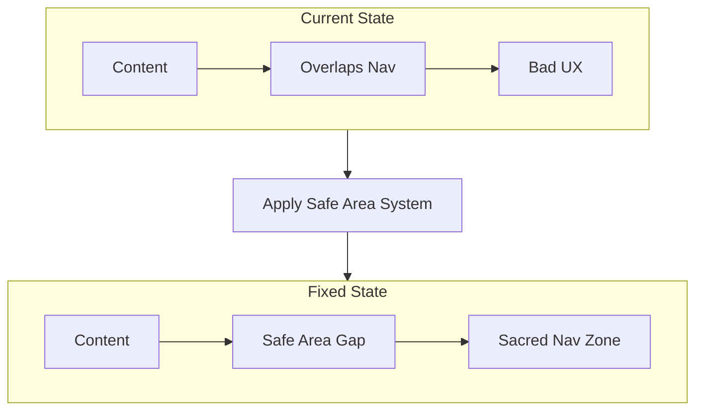

# Mobile Viewport UX Fixes

## Problem Summary

From the screenshots, there are 5 distinct UX issues:

1. **Pricing page**: Content overflows but cannot scroll - needs condensing
2. **Home page**: "Your Virtues" card touches/overlaps the bottom nav
3. **Journey page**: Chart left axis clipped, content overlaps bottom nav
4. **Meditations page**: Cannot scroll (should be scrollable)
5. **Library page**: Cannot scroll (should be scrollable)

The core issue is that content intersects with the sacred bottom navigation zone.

---

## Architecture Analysis

The `Layout` component ([src/components/wellwell/Layout.tsx](src/components/wellwell/Layout.tsx)) controls scrolling:

- `scrollable=false` (default): `overflow-hidden pb-20`
- `scrollable=true`: `overflow-y-auto pb-24`

The `BottomNav` is `fixed bottom-0` with `h-16` (64px). The current padding `pb-20` (80px) should theoretically clear it, but is inconsistent.

---

## Implementation Plan

### 1. Create Global Safe Area System

Create a CSS variable and utility class for consistent bottom spacing that accounts for:

- Nav bar height (64px)
- Safe area inset (for phones with gesture bars)
- Breathing room (12-16px)

**File**: [src/index.css](src/index.css)

```css
:root {
  --nav-height: 4rem;           /* 64px nav */
  --safe-bottom: calc(var(--nav-height) + env(safe-area-inset-bottom, 0px) + 1rem);
}

.safe-bottom { padding-bottom: var(--safe-bottom); }
```

### 2. Update Layout Component

Simplify the Layout to use the new safe area system consistently.

**File**: [src/components/wellwell/Layout.tsx](src/components/wellwell/Layout.tsx)

Key changes:

- Replace hardcoded `pb-20`/`pb-24` with `safe-bottom` utility
- Ensure `main` tag properly respects the nav bar boundary
- Add `min-h-0` to prevent flex overflow issues

### 3. Fix Pricing Page (No Scroll, Condensed)

**File**: [src/pages/Pricing.tsx](src/pages/Pricing.tsx)

Condense the pricing cards to fit in viewport:

- Reduce `p-5` to `p-3` on cards
- Use `text-xs` for feature lists instead of `text-sm`
- Reduce `mb-6` header margin to `mb-3`
- Reduce `space-y-4` to `space-y-2` between cards
- Use 2-column grid for Free tier features
- Collapse Pro features into a shorter list (show first 4, "and more...")

### 4. Fix Home Page (No Scroll, Content Fits)

**File**: [src/pages/Home.tsx](src/pages/Home.tsx)

Ensure the "Your Virtues" card has breathing room:

- Add explicit bottom padding to the container
- Reduce VoiceFirstInput internal padding slightly if needed
- The `mt-auto` on the Virtues card should work, but ensure parent has proper height constraints

### 5. Fix Journey Page

**File**: [src/pages/Profile.tsx](src/pages/Profile.tsx)

Two issues:

1. Chart clipping - fix margin in VirtueChart
2. Content touching nav - ensure proper bottom padding

**File**: [src/components/wellwell/VirtueChart.tsx](src/components/wellwell/VirtueChart.tsx)

Fix the chart margin:

- Change `left: -20` to `left: 0` or `left: 5`
- Reduce YAxis width from 30 to 25 to reclaim space

### 6. Enable Scrolling on Library Pages

**Files**:

- [src/pages/Library.tsx](src/pages/Library.tsx)
- [src/pages/MeditationsLibrary.tsx](src/pages/MeditationsLibrary.tsx)

Simply add `scrollable={true}` to the Layout component.

### 7. Update Decisions Log

**File**: [docs/DECISIONS_LOG.md](docs/DECISIONS_LOG.md)

Document this UX fix following the established format.

---

## Visual Summary



---

## Files to Modify

| File | Change |

|------|--------|

| `src/index.css` | Add safe area CSS variables |

| `src/components/wellwell/Layout.tsx` | Use safe area system |

| `src/pages/Pricing.tsx` | Condense content to fit viewport |

| `src/pages/Home.tsx` | Ensure virtues card has breathing room |

| `src/pages/Profile.tsx` | Fix bottom padding |

| `src/components/wellwell/VirtueChart.tsx` | Fix left margin clipping |

| `src/pages/Library.tsx` | Add `scrollable={true}` |

| `src/pages/MeditationsLibrary.tsx` | Add `scrollable={true}` |

| `docs/DECISIONS_LOG.md` | Document changes |